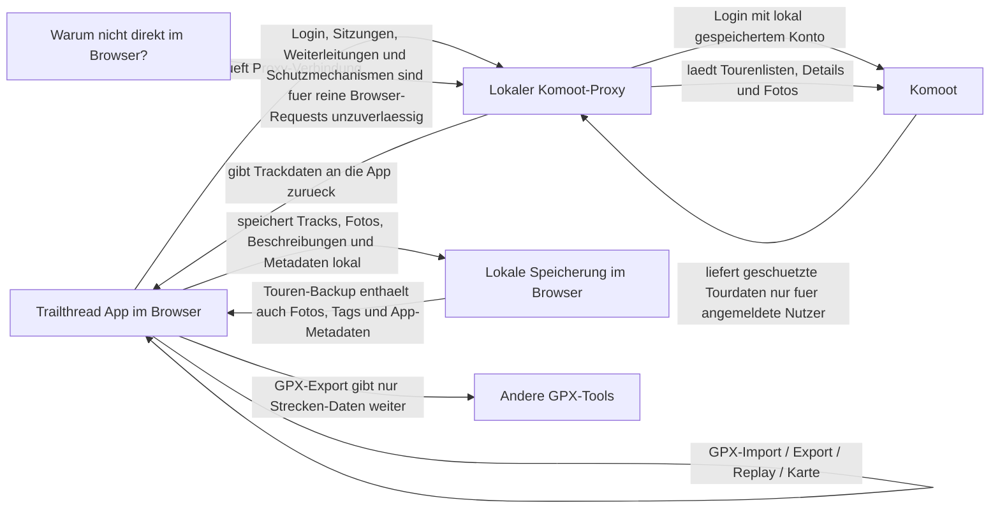

# Trailthread

Desktop-orientierte PWA fuer grosse Displays mit drei klar getrennten Bereichen fuer Touren, Karte und Replay:
- links: Workspaces und Konten
- mitte: Trail-Bibliothek
- rechts: Karte sowie aktive Workspaces wie Komoot-Download und Replay

## Projektlinks
- GitHub Pages: [https://marsrakete.github.io/trailthread/](https://marsrakete.github.io/trailthread/)
- GitHub Repository: [https://github.com/marsrakete/trailthread](https://github.com/marsrakete/trailthread)
- Kontakt: [millux@marsrakete.de](mailto:millux@marsrakete.de)

## Funktionen
- GPX-Import per Dateiauswahl
- GPX-Einzelexport pro Track aus der Bibliothek
- lokale Speicherung in IndexedDB, reload-sicher
- mehrere Tracks gleichzeitig auf Leaflet/OpenStreetMap
- mehrere gespeicherte Komoot-Konten
- separater Komoot-Workspace mit Proxy-Diagnose
- Replay-Workspace mit 2D- und 3D-Ansicht
- Wiedergabe nach Zeit oder Distanz mit Profil-, Timeline- und Fotokopplung
- Trennung von gemachten und geplanten Komoot-Touren
- App-Backup fuer Konten und Einstellungen
- separates Touren-Backup fuer alle gespeicherten Tracks
- intelligenter Touren-Backup-Import mit Konfliktabfrage ueber `lastChanged`
- Doubletten-Erkennung beim Backup-Import
- versionierte Offline-App mit zentraler `version.js`, Service Worker und Update-Pruefung in den Einstellungen
- Deutsch, Englisch und Franzoesisch

## Wichtiger Sicherheitshinweis
Die App speichert Komoot-Konten lokal inklusive Passwort, weil der lokale Proxy damit arbeiten soll.
Das App-Backup enthaelt diese Passwoerter ebenfalls.
Diese Datei deshalb nur verschluesselt oder an vertrauenswuerdigen Orten aufbewahren.

## Backup-Formate
Wichtig fuer den Unterschied zwischen normalem GPX-Export und Trailthread-Backup:
- Ein GPX-Export ist fuer den Datenaustausch mit anderen Tools gedacht.
- Ein GPX enthaelt ueblicherweise Trackpunkte, Zeit, Hoehe und einfache Metadaten.
- Fotos werden dabei normalerweise nicht in die GPX-Datei eingebettet.
- Eigene Tags haben in GPX ebenfalls keinen einheitlichen Standardplatz pro Track.
- Genau deshalb gibt es in Trailthread zusaetzlich das Touren-Backup: Es bewahrt auch Fotos, Beschreibungen, eigene Tags und weitere App-Daten eines Tracks.

App-Backup:
- Konten inklusive Passwort
- Sprache
- aktiver Workspace
- aktives Konto
- linke und mittlere Spaltenbreite
- kompakter Zustand der linken und mittleren Spalte
- Kartenmodus wie Foto-Overlay-only
- eingestellte Track-Linienbreite
- Exportzeitpunkt
- `appVersion` und `cacheVersion`

Touren-Backup:
- alle gespeicherten Tracks
- Track-Metadaten
- GPX-Inhalte
- Beschreibungen
- eigene Tags und Favoritenstatus
- Fotos inklusive gespeicherter Foto-Metadaten
- Trackpunkte und daraus abgeleitete Werte wie Distanz, Bergauf und Bergab
- importbezogene Metadaten wie Quelle, Datum, Sportart, Komoot-Infos und Farbauswahl
- `lastChanged` je Track fuer spaetere Merge-Entscheidungen beim Reimport
- Exportzeitpunkt
- `appVersion` und `cacheVersion`

Wichtig:
- Das App-Backup enthaelt keine Touren oder GPX-Dateien.
- Das Touren-Backup enthaelt keine Konten, Passwoerter oder App-Einstellungen.
- Ein Touren-Backup kann komplett oder nur fuer die aktuell ausgewaehlten Tracks erstellt werden.
- Auch Teil-Backups bleiben spaeter wieder importierbar und laufen durch denselben Merge mit `lastChanged`.
- Dadurch lassen sich einzelne Tracks inklusive Fotos, Beschreibungen, Tags und Metadaten gezielt mit anderen Nutzern teilen.
- Beim Reimport von Touren-Backups werden Tracks mit gleicher ID anhand von `lastChanged` verglichen und bei Bedarf einzeln zur Ueberschreibung bestaetigt.

## Update-Mechanismus
- Die PWA fuehrt ihre sichtbare Version zentral in [version.js](/C:/Users/millenseer/OneDrive%20-%20conet.de/Projekte/GPX/version.js:1).
- `app.js` und `sw.js` lesen `appVersion`, `cacheVersion` und Label aus dieser einen Datei.
- In den Einstellungen zeigt der Bereich `Aktualisierungen` die lokale Version an und kann eine neuere `version.js` per `cache: "no-cache"` pruefen.
- Wenn `appVersion` oder `cacheVersion` abweichen, wird ein Reload angeboten, damit die neue Offline-Version aktiv wird.

## Komoot-Import Und Lokaler Proxy
Trailthread laedt Komoot-Tracks bewusst ohne eigene Cloud und ohne fremden Server. Die App spricht also nicht erst mit einem Online-Dienst von Trailthread, sondern arbeitet lokal auf deinem Rechner. Deine Touren, Fotos und Backups bleiben damit bei dir.

Damit Komoot-Touren geladen werden koennen, musst du dich trotzdem mit deinem Komoot-Konto anmelden. Der Grund ist einfach: Komoot gibt persoenliche Touren nur fuer dein angemeldetes Konto frei. Trailthread braucht diese Anmeldung also nicht fuer Werbung oder eine eigene Cloud, sondern nur, damit dein lokaler Proxy Komoot in deinem Namen nach deinen Touren fragen kann.

Warum ist dafuer ein lokaler Proxy noetig? Ein normaler Browser darf sich nicht einfach wie eine andere App bei Komoot anmelden und danach geschuetzte Tourdaten laden. Sitzungen, Weiterleitungen, Login-Antworten und Schutzmechanismen der Website lassen sich auf diese Weise im Browser allein nicht sauber und zuverlaessig abbilden. Deshalb laeuft daneben ein kleiner lokaler Helfer. Er nimmt nur die Anfragen deiner lokalen Trailthread-App entgegen, meldet sich bei Komoot an und liefert die geladenen Daten wieder an die App zurueck.

Unter Windows ist der Start einfach:
1. Ein PowerShell-Fenster im Projektordner oeffnen.
2. Die App starten mit `.\start-server.ps1`.
3. Fuer Komoot ein zweites PowerShell-Fenster oeffnen.
4. Dort den lokalen Proxy starten mit `.\start-komoot-proxy.ps1 -Mode real`.
5. Danach Trailthread im Browser oeffnen und im Komoot-Bereich dein Konto verbinden.

Wenn du nur ausprobieren willst, kannst du statt echter Komoot-Daten auch den Demo-Modus nutzen:
- `.\start-komoot-proxy.ps1 -Mode stub`

Zusätzlich wichtig:
- GPX-Dateien koennen direkt in die Bibliothek importiert werden.
- Gespeicherte Tracks koennen einzeln wieder als GPX exportiert werden.
- Mehrere ausgewaehlte Tracks koennen als ZIP mit einzelnen GPX-Dateien exportiert werden.
- Optional koennen mehrere ausgewaehlte Tracks auch als eine gemeinsame Multi-Track-GPX exportiert werden.
- Fuer komplette Sicherungen gibt es ausserdem App-Backup und Touren-Backup.
- Das Touren-Backup gibt es auch fuer nur ausgewaehlte Tracks, damit sich komplette Trailthread-Tracks samt Fotos teilen lassen.

## Technischer Hintergrund
Trailthread selbst ist eine lokale Web-App. Sie speichert ihre Daten im Browser, zeigt Karte und Replay an und verwaltet Tracks, Fotos, Beschreibungen, Backups und Einstellungen. Die App kann GPX-Dateien direkt importieren und einzelne Tracks wieder als GPX exportieren.

Ein wichtiger Punkt dabei: GPX ist bewusst nur das Austauschformat fuer Strecken. Wenn du einen Track als GPX exportierst, nimmst du vor allem Geometrie, Zeit, Hoehe und einfache Metadaten mit. Die Fotos eines Tracks sind dagegen ein bewusstes Mehrwert-Merkmal von Trailthread und bleiben deshalb im gespeicherten Track sowie im Touren-Backup erhalten. Dasselbe gilt fuer eigene Tags und den Favoritenstatus. Genau das unterscheidet den einfachen GPX-Export von einer echten Trailthread-Sicherung.

Der Komoot-Teil ist davon getrennt: Dafuer gibt es den lokalen Proxy. Die App prueft im Komoot-Bereich zuerst, ob dieser Proxy erreichbar ist, und zeigt den Zustand auch in der Diagnose an. Erst wenn der Proxy laeuft, kann sich Trailthread ueber ihn bei Komoot anmelden, Tourenlisten abrufen und ausgewaehlte Touren importieren.

Der Proxy uebernimmt dabei vor allem:
- Anmeldung bei Komoot
- Laden von Tourenlisten
- Laden von Tour-Details
- Laden von Tour-Fotos
- Umwandlung der geladenen Trackdaten in das Format, das Trailthread intern speichert

Die App selbst uebernimmt danach:
- Anzeige in Bibliothek, Karte und Replay
- lokale Speicherung aller importierten Daten
- GPX-Einzelexport
- GPX-Export fuer mehrere ausgewaehlte Tracks als ZIP oder als Multi-Track-GPX
- App-Backup und Touren-Backup

Die beiden Backup-Arten sind bewusst getrennt:
- Das App-Backup enthaelt Konten, Sprache, Layout- und Anzeigeeinstellungen sowie Versionsangaben.
- Das Touren-Backup enthaelt die gespeicherten Tracks mit GPX-Inhalt, Beschreibungen, eigenen Tags, Favoritenstatus, Fotos, Trackpunkten, abgeleiteten Werten und `lastChanged` fuer spaetere Merge-Entscheidungen.
- Das App-Backup enthaelt keine Touren.
- Das Touren-Backup enthaelt keine Konten oder App-Einstellungen.

Fuer den Komoot-Import nutzt der Proxy beobachtete Komoot-Web/API-Endpunkte unter `api.komoot.de`, zum Beispiel fuer Login, Tourenlisten, Tour-Details und Tour-Fotos. In diesem Projekt wird kein separates Komoot-SDK verwendet. Als Referenz fuer die Struktur einzelner inoffizieller Endpunkte diente unter anderem der inoffizielle Client [janthomas89/komoot-api-client](https://github.com/janthomas89/komoot-api-client). Diese Referenz ist keine Laufzeit-Abhaengigkeit von Trailthread. Wenn Komoot diese Endpunkte aendert, muss der Import gegebenenfalls angepasst werden.

## Lizenz
Dieses Projekt steht unter `GPL-3.0-only`.
Siehe [LICENSE](LICENSE).
